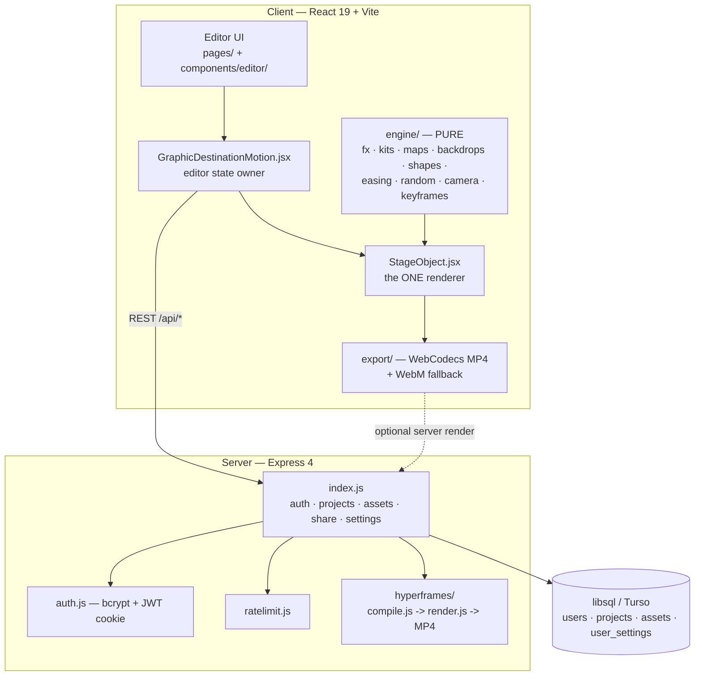

# Architecture

GraphicDestination Motion ("Zwoosh") is a browser-native motion-graphics studio:
a React editor drives a **pure, deterministic render engine**; the same engine
renders the editor preview, the client-side video export, and (via a translation
layer) the optional server-side MP4 render. An Express + libsql backend handles
accounts, cloud projects, assets, sharing, and settings.

This document is the map. For the *rules* that keep it working, see
[AGENTS.md](AGENTS.md); for the render pipeline in depth, see
[RENDERING.md](RENDERING.md).

## System overview



## The determinism contract (the core invariant)

Every visual is a **pure function of timeline time `t`**. Given the same
`StageObject` and the same `t`, the output pixels are identical — on every
machine, every run. This is what makes the export path trustworthy: export just
re-renders the editor engine frame-by-frame at fixed timestamps.

Consequences, enforced by AGENTS.md and the check suites:

- **No `Date.now()`, no unseeded `Math.random()`** anywhere on a render path.
  Randomness comes from `engine/random.js` (mulberry32, seeded).
- **One renderer, three consumers.** `components/StageObject.jsx` is the single
  source of truth for how an object looks at time `t`. The editor preview, the
  SSR path, and the frame exporter all call into it — there is no second
  "export renderer" to drift out of sync.
- **Back-compat is permanent.** Old project JSON must keep rendering; unknown
  fields are mapped or ignored, never fatal.

## Client

### Layout

```
client/src/
  main.jsx, App.jsx          app shell + router (react-router 7)
  AuthContext.jsx, api.js    session state + typed REST client
  pages/                     Landing, Login, Dashboard, Templates, Editor,
                             Settings, PublicPlayer
  components/
    GraphicDestinationMotion.jsx   editor state owner (cloud seam:
                                   initialProject in, onChange out)
    StageObject.jsx                THE renderer (preview + SSR + export)
    ExportDialog.jsx, ShareDialog.jsx
    editor/
      StageView.jsx, Timeline.jsx, Inspector.jsx, TopBar.jsx, IconRail.jsx
      PathEditor.jsx, snapping.js, model.js, ui.jsx, modals.jsx
      panels/               one panel per widget family (Text, Shapes, Icons,
                            Charts, Maps, Numbers, Confetti, Backgrounds,
                            Templates, Image, Audio, UIElements)
  engine/                   PURE modules (no DOM, no I/O, no clock):
    fx.js                   charts / numbers / counters / confetti
    kits.js                 57 bezier icons + UI elements
    maps.js + mapdata.js    239 countries / 7 continents (154 KB data)
    backdrops.js            11 procedural backdrop variants
    shapes.js               shape geometry + morph point sampling
    easing.js               10 easings (piecewise, shared with server EASE_MAP)
    random.js               mulberry32 seeded PRNG
    camera.js               project.camera.tracks {x,y,zoom} + per-object depth
    keyframes.js            keyframe sampling / interpolation
    filters.js              visual filters
  export/                   see "Export pipeline" below
  lib/                      audioTrack, imagePrep, settings helpers
  templates/templates.js    built-in templates (inserted as movable groups)
```

### State & data flow

`GraphicDestinationMotion.jsx` owns editor state and exposes a **cloud seam** —
`initialProject` in, `onChange` out — so the editor is agnostic to persistence.
`pages/Editor.jsx` wires that seam to the REST API via `api.js`. A project is a
single JSON document (objects, tracks, keyframes, camera, background); it is what
gets saved, shared, exported, and server-rendered.

### Export pipeline (`client/src/export/`)

Deterministic, client-side, no server required:

1. `frameRenderer.js` steps the engine frame-by-frame at fixed µs timestamps.
2. `exportMp4.js` encodes via **WebCodecs** into an `mp4-muxer` container.
3. `exportWebm.js` is the fallback (MediaRecorder VP9/VP8); `ts-ebml` repairs the
   WebM duration header.
4. All referenced assets are inlined as **data URIs** first — blob-URL SVGs would
   taint the canvas and produce empty exports (a real past regression).
5. `audioMix.js` mixes the audio track into the output.

Fidelity is guarded by `test-stage-roundtrip.mjs`, `validateFrameMath.mjs`, and
the per-feature export tests.

## Server (`server/`)

Express 4, ES modules, stateless container.

| File | Responsibility |
|---|---|
| `index.js` | All routes: health, auth, projects CRUD, share links, asset library, user settings, HyperFrames compile/render, static client. **Additive-only** by convention. |
| `auth.js` | bcrypt (cost 12), JWT signing/verify, `requireAuth` middleware, cookie options. Falls back to an ephemeral `JWT_SECRET` for zero-config boot (dev only). |
| `db.js` | libsql client. Turso remote-only when `TURSO_*` set (stateless, mirror-safe); local SQLite file otherwise. Owns `initSchema()` (idempotent). |
| `ratelimit.js` | Zero-dependency in-memory sliding-window limiter, bounded three ways (per-request prune, periodic sweep, hard key cap). |
| `seed.js` | Creates the bootstrap admin, prints the password once. |
| `hyperframes/` | Server-side MP4 render (see below). |

### Data model

```
users(id, username UNIQUE, password_hash, role, must_change_password, created_at)
projects(id, owner_id→users, name, data JSON, updated_at, created_at, share_token?)
assets(id, owner_id→users, name, mime, data base64, size, created_at)
user_settings(user_id PK→users, json, updated_at)
```

All tenant queries are scoped by `owner_id = req.user.sub`. Assets are stored as
base64 **text** (the remote-only Turso client binds no BLOBs) and served with the
right `Content-Type` from `GET /api/assets/:id`.

### API surface

| Route | Auth | Purpose |
|---|---|---|
| `GET /api/health` | — | liveness `{ ok, db }` |
| `GET /api/ready` | — | readiness — DB reachable (503 if not) |
| `GET /metrics` | optional bearer | Prometheus RED + process metrics |
| `POST /api/auth/signup` / `login` | rate-limited | create / authenticate (sets cookie) |
| `POST /api/auth/logout`, `GET /api/auth/me`, `POST /api/auth/change-password` | session | session lifecycle |
| `GET/POST/PUT/DELETE /api/projects[/:id]` | session | owner-scoped project CRUD |
| `POST/DELETE /api/projects/:id/share` | session | enable / disable public link |
| `GET /api/share/:token` | public, rate-limited | read a shared composition (`{name,data}` only) |
| `GET /api/share/:token/assets/:assetId` | public, rate-limited | assets referenced by that shared project only |
| `GET/POST/DELETE /api/assets[/:id]` | session | asset library (MIME allowlist, size caps, quota) |
| `GET/PUT /api/settings` | session, rate-limited | per-user brand kits / text styles / default bg (validated + size-capped) |
| `POST /api/render/compile` | session | project JSON → HyperFrames HTML (always works) |
| `POST /api/projects/:id/render` | session | server-side MP4 (degrades to `{rendered:false, hint}`) |

### Server-side render (`server/hyperframes/`)

Optional, opt-in, gracefully degrading:

- `compile.js` — **pure** function: project JSON → HyperFrames HTML. Always
  works, fully unit-testable (`test-compile.mjs`). Translates transforms,
  keyframes, easings (`EASE_MAP` mirrors the client), in/out windows, nested
  clips (flattened to absolute time). Features it can't yet port emit a
  `warnings[]` entry naming the exact layer — nothing silently drops.
- `render.js` — shells out to the real `hyperframes` CLI to turn that HTML into
  MP4. Needs the (optional) `hyperframes` package + a Chromium binary;
  `findExistingChromium()` locates a cached browser. Absent either, the endpoint
  returns `{rendered:false, reason, hint, html}` — never a hard failure.

See [RENDERING.md](RENDERING.md) for the full translation table and what was
verified end-to-end.

## Deploy

- **Docker** (`Dockerfile`): builds the client from the npm registry; installs
  the server from a **vendored tarball** (`vendor/server-deps.tar.gz`) so the
  image build needs zero network for server deps — hardened against mirror/DNS
  flakiness. Do not edit `Dockerfile` / `vendor/` casually (AGENTS.md rule #5).
- **Railway** (`railway.json`): NIXPACKS build (client build + server install),
  `node server/index.js` start, restart-on-failure.
- Production serves the built client (`client/dist`) as static files from the
  same Express server; `GET *` returns `index.html` for SPA routing, `/api/*`
  falls through to a JSON 404.

## Testing topology

No test framework — the battery is ~45 self-contained Node scripts that print
PASS/FAIL and exit non-zero on failure. `scripts/run-checks.mjs` discovers and
runs them all. Groups: **client** (`check-*.mjs`, engine/editor units),
**export** (`src/export/test-*.mjs`, render fidelity), **lib**
(`src/lib/*.check.mjs`), **server** (`test-*.mjs`, each boots its own server on a
distinct port 8790–8795). See [CONTRIBUTING.md](CONTRIBUTING.md#testing).
